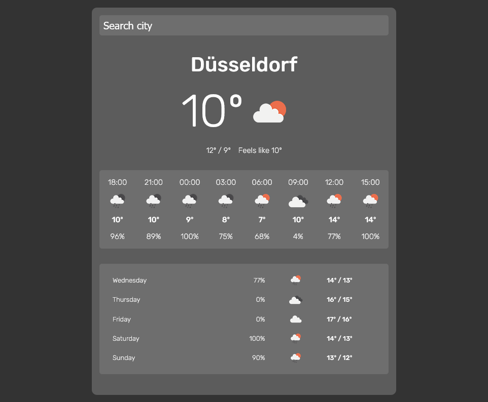

# Weather App

This app allows you to see current weather and forecast for your location or for a selected city.

## Table of contents

- [Weather App](#weather-app)
  - [Table of contents](#table-of-contents)
  - [Links](#links)
  - [Overview](#overview)
    - [The challenge](#the-challenge)
    - [Screenshots](#screenshots)
  - [My process](#my-process)
    - [Built with](#built-with)
    - [APIs](#apis)
  - [Author](#author)

## Links

- Solution URL: [https://github.com/evertzner/weather](https://github.com/evertzner/weather)
- Live Site URL: [https://cheery-lolly-445d20.netlify.app/](https://cheery-lolly-445d20.netlify.app/)

## Overview

### The challenge

Users should be able to:

- See current weather
- See weather for following hours
- See weather forecast for following days
- Change city weather by searching it

### Screenshots

**Main page**

**Search a city**

**Main page in small devices**

## My process

### Built with

- Semantic HTML5 markup
- Flexbox
- CSS Grid
- [Sass](https://sass-lang.com/) - CSS with superpowers
- [Axios](https://axios-http.com/) - Promise based HTTP client
- [React](https://reactjs.org/) - JS library
- [Easy Peasy](https://easy-peasy.vercel.app/) - Easy Peasy is an abstraction of Redux

### APIs

- [Spott](https://rapidapi.com/Spott/api/spott/details) - Locate user by IP
- [OpenWeather](https://openweathermap.org/api) - Weather & Forecast information
- [GeoDB Cities](https://rapidapi.com/wirefreethought/api/geodb-cities/details) - Search Cities

## Author

- GitHub - [evertzner](https://github.com/evertzner)
- LinkedIn - [@esteban-vertzner](https://www.linkedin.com/in/esteban-vertzner/)